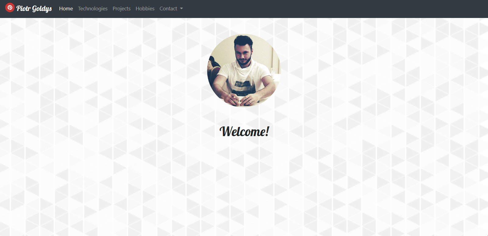

 
  > 06.2018

## __General Info__
Simple portfolio website.  
 
I created it in order to utilize freshly learned Django framework skills, accompanied by some HTML, CSS and Bootstrap.
Website is fully responsive on smaller devices.

### __Technologies__
*  __Python__ 3.7.0
*  __Django__ framework
*  __HTML__
*  __CSS__
*  __Bootstrap__

## __Setup__

These instructions will get you a copy of the project up and running on your local machine.

### __Prerequisites__

* <a target="_blank" rel="noopener noreferrer" href="https://www.python.org/downloads/">Python 3.7.0</a>
* Django 2.0.7

### __Instructions__

   1. Download and install <a target="_blank" rel="noopener noreferrer" href="https://www.python.org/downloads/">Python 3.7.0</a>
.
   2. Download or clone the repository.
   3. Create and activate virtualenv on your machine.
   4. Install required files from `requirements.txt`. You can do it easily with `pip install -r requirements.txt` command.
   5. Run server in your IDE or manually - `python manage.py runserver`.
    
   The website is up and running! You can now access it in your web browser at `localhost:8000` address.

## __Authors__

* **Piotr Goldys** 
    * <a href="https://github.com/Pegietix"> GitHub</a>
    * <a href="https://facebook.com/Pitold"> Facebook</a>
    * <a href="https://www.linkedin.com/in/piotr-goldys/"> LinkedIn</a>
    *  piotr.goldys9@gmail.com</a>
    

